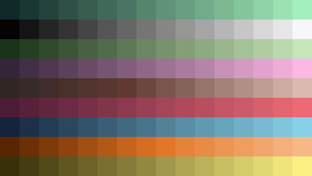
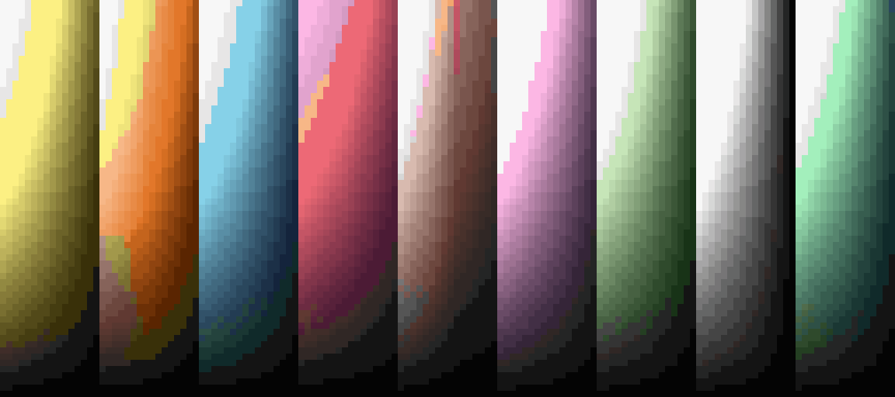

# Paletter

This creates color LUTs for palettes in indexed-color style graphics engines. For example, running `paletter palette.img` will turn the following palette

into a Quake-style color LUT:

